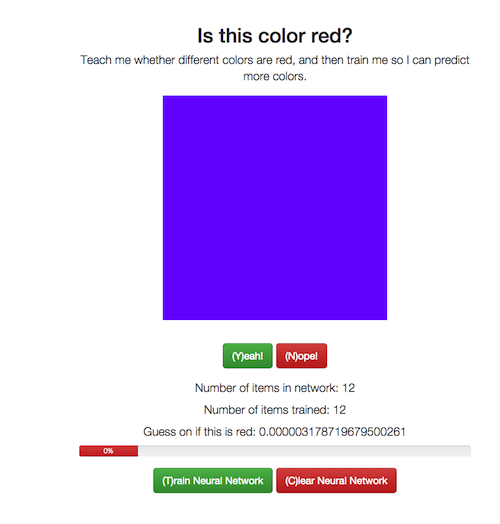

# Neural Network

A demo of how to use a Neural Network in Node.js

I wanted to get into machine learning and decided that a good way to start would be to build a neural network that could be taugh the color red.

After spending a few weeks trying to implement my own neural network, it was pointed out to me by friends that this is an awful idea, as the math is so complex that the chances of introducing a tiny error which renders the whole network unusable is near limitless.  Instead, I downloaded the excellent [Node Brain](https://github.com/harthur/brain) module which already implments a neural network.  If you haven't checked out Brain, please give it a try.

## Prerequisites

A relatively recent verison of Node.js.  You can find downloads for your platform [over here](http://nodejs.org/download/).

## Installation

- Download a copy of this repo: `git@github.com:dmuth/neural-network.git`
- Type `cd neural-network`
- Type `npm install` to install the third-party modules this app depends on
- Type `npm start`
- Point your browser to [http://localhost:3000/](http://localhost:3000/)

## Usage

The front page of the website will display a screen with a color, and a "Yes" and "No" button to tell the neural network whether the color is red or not.  After you answer at least once, you'll see two more buttons: "Train Neural Network" and "Clear Neutral Network".

Try making about 10 guesses, then train the neural network.  Future page views will show a percentage bar which is the output of the neural network on that particular color.  Higher values mean a higher confidence that the color is red.  If you'd like to see the results of 1,000 guesses, click the "Take Guesses" button in the menu at the top of the screen.

 

## Hotkeys

- **(H)** - Home
- **(Y)** - Yes, the color is red
- **(N)** - No, the color is not red
- **(T)** - Train neural network
- **(C)** - Clear neural network
- **(G)** - Take 1,000 guesses on random colors
- **(S)** - "secret" :-)  Create a random color that has the red value doubled and the blue and green values halved
    - This is useful when getting false positives.  Keep mashing "S" until you get a color that's not red, 
    	but has a percentage higher than 10%. Then hit "No" and re-train the neural network.

## Comments on neural networks in general

While experimenting with this, I saw that a properly trained neural network could do a decent job of picking out the color red with as few as 10-20 gueses.  This is amazing.  Conversaly, a network fed poor quality data (lots of not-red colros) would still perform poorly despite having 50+ pieces of data in it.  As I learned, neureal networks are great at spotting **signals within a data set**.  If your data is poor quality and there is little signal, the output of your neural network will also be low quality.

## Development

- `./bin/devel.sh` - Spin up a Docker Container with an interactive shell
- `./bin/push.sh` - Push Docker container to Docker Hub

# TODO

- Clean up UI a little on main page, the buttons are kinda haphazard
- Image rollover on guess page to enter data
- /history page to get all training data from neural network and display original guess and current guess

